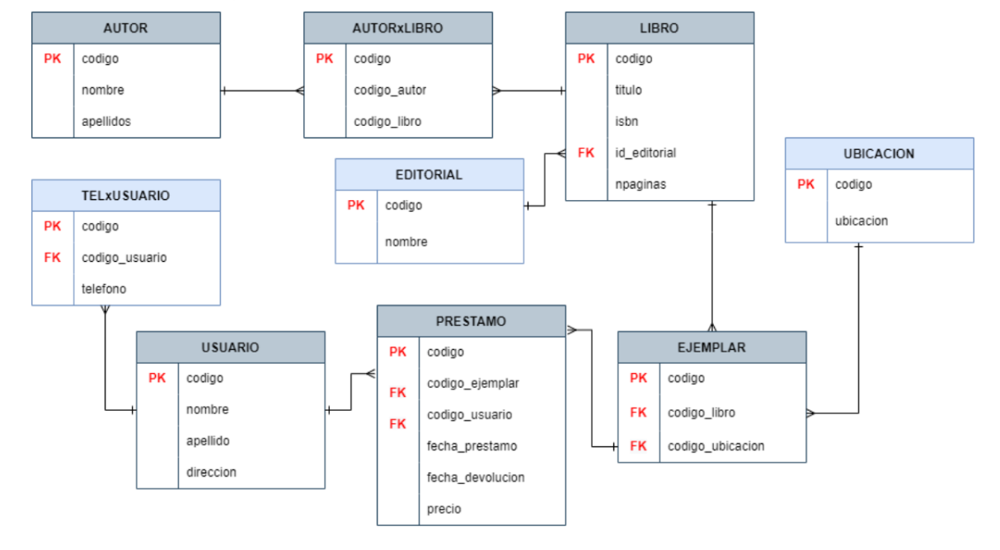
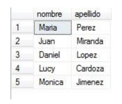
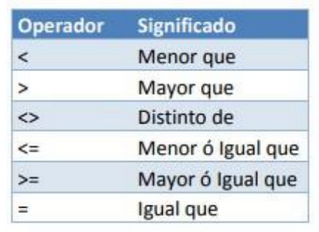
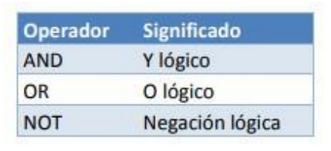

author: Karla Aguilar, Alejandra Marroquin,
summary: Consultas Simples con Select y Joins
id: laboratorio-04
tags: guide
categories: SELECT,AS,WHERE,OPERADORES LOGICOS,CONSULTAS CON JOINS
environments: Web
status: Published
feedback link: https://github.com/01-2022-Bases-de-datos-UCA/Codelabs/issues


# Consultas Simples con Select y Joins


## Consultas SQL (SELECT)
Duration: 0:1:00

La sentencia SELECT es una sentencia DML (Lenguaje de Manipulación de Datos)
utilizada para seleccionar datos de una base de datos, es también conocida como
consulta de selección.

### **ESTRUCTURA DEL SELECT**

La sintaxis básica de una consulta de selección es la siguiente:
```
SELECT [CAMPOS] FROM [TABLA] [WHERE [CONDITION]];
```

En donde [CAMPOS] son los atributos o columnas que se desean extraer de la [TABLA]
que se especifique y WHERE es opcional, esta condición será utilizada más adelante.
Consideremos la siguiente base de datos:



Si se quiere extraer solamente el nombre y apellido de la tabla USUARIO se hace de la
siguiente manera:

```
SELECT nombre, apellido FROM usuario;
```

Dando como resultado:



Si se desea extraer todos los campos de una tabla se utiliza * de la siguiente manera:

```
SELECT * FROM usuario;
```
Esta instrucción devolverá todos los registros y todos los campos que la tabla posea.

## ALIAS (AS)
Duration: 0:3:00

En muchos casos es necesario asignar un nombre a alguna columna o tabla, cuando se
le asigna un alias a una columna el nombre de la columna cambia en el resultado,
mientras que cuando se usa el alias en la tabla este sirve para identificar campos que
tengan el mismo nombre en distintas tablas.
Por ejemplo se desea extraer todos los nombres de la tabla AUTOR y todos los nombres
de la tabla USUARIO, pero que al mostrarse se llamen Nombres de Autores y Nombres
de Usuarios; ¿Qué problema habría si se quita el alias a las tablas?

```
SELECT u.nombre as "Nombre Usuario", a.nombre as "Nombre Autor" FROM usuario as u, autor as a;
```

¿Por qué el resultado de esta consulta está lleno de duplicidad?

## CLAUSULA CONDICIONAL WHERE
Duration 0:04:00

Esta cláusula devuelve un subconjunto de los registros de una tabla que cumplan con
dicha condición.

```
SELECT * FROM libro WHERE npaginas = 300;
```

Esta consulta devuelve los registros de la tabla LIBRO que cumplan la condición de tener
300 páginas.

Otros operadores que se pueden usar en la cláusula WHERE:



Además de estos operadores lógicos se disponen otros adicionales:

### **BETWEEN**

Indica un intervalo de valores:

```
SELECT * FROM libro WHERE npaginas BETWEEN 1 AND 500;
```
Esta instrucción devuelve los registros de la tabla LIBRO que tengan entre 1 a 500
páginas.

### **LIKE**

Sirve para comparar patrones de texto:

```
SELECT * FROM autor WHERE nombre LIKE 'l%';
```
Devuelve todos los autores cuyo nombre comience con “L”.

Lista de patrones de texto: https://www.w3schools.com/sql/sql_wildcards.asp

### **IN**
Sirve para comparar con una lista de valores fijos:

```
    SELECT num, calle, direccion
    FROM direccion 
    WHERE ciudad IN ('Sevilla','Cordoba','Huelva','Cádiz');
```

### **IS NULL / IS NOT NULL**

Devuelve los registros que sean o no sean nulos. Este operador lógico se verá más
adelante cuando se trabajen los JOINS.


## OPERADORES LÓGICOS
Duration: 0:04:00

Sirven para componer expresiones y filtrar aún más los registros de una tabla.



```
    SELECT * FROM libro WHERE npaginas > 500 AND titulo LIKE 'a%';
```

Esta consulta devuelve los registros de la tabla libro que tengan más de 550 páginas y
el título comience con la letra a.


## Sobre los autores de esta guía práctica

Autores:  
  **Versión 1:**
Emerson Gamaliel Nolasco (00215316@uca.edu.sv), Kevin Enmanuel Velásquez (00018616@uca.edu.sv)      
  **Versión 2:** 
Fátima Adriana Renderos (00064018@uca.edu.sv)  
  **Versión 3:**
Karla Marielos Aguilar Figueroa (00078913@uca.edu.sv), Alejandra Mabel Marroquin Cáceres(00007415@uca.edu.sv)    
  **Responsables:**
Erick Varela Guzmán (evarela@uca.edu.sv), Douglas Hernández Torres (dohernandez@uca.edu.sv), 
Correspondencia: evarela@uca.edu.sv

Departamento de Electrónica e Informática, Universidad Centroamericana José Simeón Cañas, La Libertad, El Salvador.

Versión de este documento: Versión 3, 2022.

 This work is licensed under a [Creative Commons Attribution-NonCommercial-ShareAlike 4.0 International License](http://creativecommons.org/licenses/by-nc-sa/4.0/).